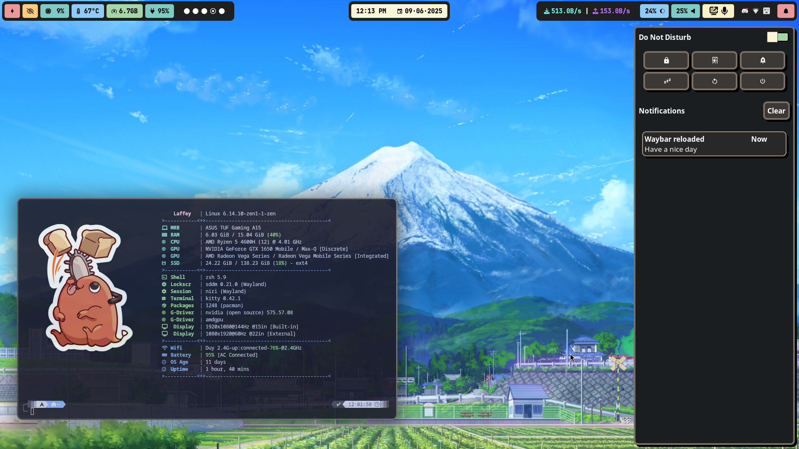

<div align="center">
    <h1>Crylia Theme</h1>
</div>

---



---

<div align="center">
    <h1>Welcome to my dotfiles</h1>
</div>
<div align="center">

A Niri theme inspired by [this Crylia-theme](https://github.com/Crylia/crylia-theme) and other stuffs I found online.

This repository holds mainly my Niri rice and maybe more in the future (I lied)

Everything you see is done purely because I'm unemployed and hate myself.
</div>

## Information

---
<image align="right" width="450px" src="assets/fastfetch.png"/>

**My system setup**:

- **OS**: [Arch Linux](https://archlinux.org/) (btw)
- **WM**: [Niri WM](https://github.com/YaLTeR/niri)
- **Terminal**: [Kitty](https://github.com/kovidgoyal/kitty)
- **Shell**: [ZSH](https://github.com/ohmyzsh/ohmyzsh)
- **Application Launcher**: [Rofi](https://github.com/davatorium/rofi)
- **File Manager**: [Nautilus](https://github.com/GNOME/nautilus)
- **Cursor**: [Bibata Modern Ice](https://github.com/ful1e5/Bibata_Cursor)
- **Font**: [JetBrainsMonoNerdFont](https://www.nerdfonts.com/font-downloads)
- **Editor**: [NeoVim](https://neovim.io/)

## Dependencies

---

#### Here are list of what you need
##### #Note that im only using Arch linux now, and using `yay` as AUR.

#### **Niri WM**

```bash
sudo pacman -Sy --needed niri
```

#### **Kitty**

```bash
sudo pacman -Sy --needed kitty
```

#### **App Launcher**

```bash
sudo pacman -Sy --needed fuzzel rofi
```

#### **File Manager**

```bash
sudo pacman -Sy --needed nautilus
```

#### **Waybar**

```bash
sudo pacman -Sy --needed waybar
```

#### **Cursor**

```bash
yay -Sy --needed
```


